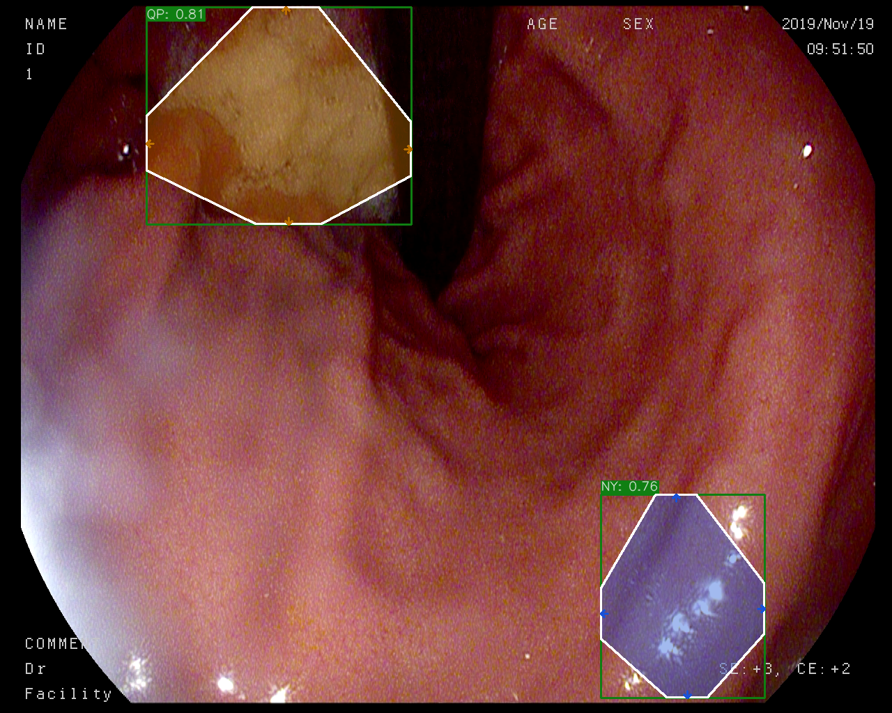

## ExtremeNet 训练和测试

**Xu Jing**

[arxiv](https://arxiv.org/abs/1901.08043) [code](https://github.com/xingyizhou/ExtremeNet)

该repo基于ExtremeNet的代码并且包含了Deep Extreme Cut(DEXTR), 对原作者表示感谢！


### 1.安装环境

本项目基于Python3.X(推荐Python3.5或3.6)和Pytorch v0.4.1，ExtremeNet的原项目基于CornerNet,其安装环境如下


+ 1.安装必要的Python模块

```
# No Anaconda 
pip3 install virtualenv 
# 创建python3虚拟环境
virtualenv -p python3 ExtremeNet
# 进入虚拟环境
source ExtremeNet/bin/activate
pip3 install -r requirement.txt -i https://pypi.tuna.tsinghua.edu.cn/simple
# 退出虚拟环境
deactivate

```

```
# Anaconda
# 创建虚拟环境并安装package
conda create --name ExtremeNet --file conda_packagelist.txt --channel pytorch
# 开启虚拟环境
conda create --name ExtremeNet --file conda_packagelist.txt --channel pytorch
source activate ExtremeNet
# 退出虚拟环境
deactivate
```

+ 2.编译NMS

```
cd $ExtremeNet_ROOT/external
make
```


### 2.数据准备

+ 1.数据标注我们仍然采用VOC数据，将VOC标注的XML数据转化为txt文件，其文件结构如下：

```
#  图像名称    GT个数  label_id  左上角x  左上角y GT_width   GT_height ...
   xxx.jpg      7       1        368     342     100        91      1 468 355 64 72 1 700 216 43 46 1 712 149 35 38 1 771 115 28 32 1 790 140 21 20 1 643 65 11 13

# 注意列与列之间用空格间隔，不包含列明
```

可以运行如下代码把XML转成txt.

```
python3 xml2txt.py
```

+ 2.txt转COCO标注的json文件

运行将txt文档转化成COCO标注的json文档：

```
python3 txt2coco.py
```

### 3.修改项目源码，支持训练自己的数据

数据结构：

```
${ExtremeNet_ROOT}
|-- myData
`-- |-- coco
    `-- |-- annotations
        |   |-- boundingbox_train.json 
        |   |-- boundingbox_val.json
        |   |-- boundingbox_train_test.json # 暂时不做
        `-- images
            |-- train  
            |-- val
            |-- test  # 暂时不做
```

#### 3.1 修改 `tools/gen_coco_extreme_points.py`

+ 更改相关路径为自己的路径：

```
# 更改相关路径为自己的路径：
SPLITS = ['train','val']
ANN_PATH = '../myData/coco/annotations/boundingbox_{}.json'
OUT_PATH = '../myData/coco/annotations/boundingbox_extreme_{}.json'
IMG_DIR = '../myData/coco/images/{}/'
```

+ 更改函数` _get_extreme_points`，因为我的极点设置为，top和bottom分别取边的中点，left和right取终点位置处

ExtremeNet需要的训练集是COCO实例分割的标注部分，这样可以更好的定位训练数据的4个极值点和中心点，但是因为我们的项目开始的标注仅有Bounding Box,但是我们想训练ExtremeNet的性能，只能通过该退而求其次的办法。


```
def _get_extreme_points(pts):
    """
    t: top, b: bottom, l: left, r: right, ep: extreme point
    :param pts: [ [tl_x, tl_y],
                  [tr_x, tr_y],
                  [br_x, br_y],
                  [bl_x, bl_y] ]
    :return:    [ [ept_x, ept_y],
                  [epl_x, epl_y],
                  [epb_x, epb_y],
                  [epr_x, epr_y] ]
    """
    # top bottom points 1/2
    ept_x = (pts[1, 0] - pts[0, 0])/2 + pts[0, 0]
    ept_y = pts[0, 1]
    epl_x = pts[0, 0]
    # left extreme point 3/5
    epl_y = (pts[3, 1] - pts[0, 1])*0.6 + pts[0, 1]
    epb_x = ept_x
    epb_y = pts[3, 1]
    epr_x = pts[1, 0]
    # left extreme point 3/5
    epr_y = epl_y
 
    tt = [ept_x, ept_y]
    ll = [epl_x, epl_y]
    bb = [epb_x, epb_y]
    rr = [epr_x, epr_y]
 
    return np.array([tt, ll, bb, rr])

```

修改类别个数：

```
num_classes = 3  # 需要修改！, 我们仅有3个类别
```


#### 3.2 修改 `db/coco_extreme.py`

修改细节参考`db/coco_extreme.py`,类似的方式可以更改`coco.py`

#### 3.3  修改`config/ExtremeNet.json或ExtremeNet-multi_scale.json`

修改类别数，我这里只有3类。

```
"categories": 3
```

根据自己的需求设置 `batch_size, max_iter, stepsize, snapshot, chunk_sizes`。注`chunk_size`中的所有数加起来等于`batch_size`

```
"batch_size": 16,
 
"max_iter": 200000,
"stepsize": 50000,
"snapshot": 5000,
 
"chunk_sizes": [16], # 因为就1个GPU

"data_dir": "./myData",
```

其他配置根据自己需要修改即可！


### 4.从Bounding Box中生成极值点的标注:

```
cd $ExtremeNet_ROOT/tools/
python3 gen_coco_extreme_points.py  # 我们已经修改支持bounding box 生成
```

在`myData/coco/annotations/`将会产生 `boundingbox_extreme_train.json` and `boundingbox_extreme_val.json` .


### 5.Train

下载预训练的CornerNet,放在`./cache`文件夹下，并运行：

```
python3 train.py ExtremeNet 
python train.py ExtremeNet --iter 50000
```

### 6.Inference

```
# 注意将config修改成自己类别个数
# 注释掉： ./models/exkp.py中的debugger.show_all_imgs(pause=False) 不显示相关图像
python3 demo.py [--demo /path/to/image/or/folder] [--show_mask]
python3 demo.py --demo ./images/test_score/test1.jpg # 单张图片
python3 demo.py --demo ./images/test_score  # 目录
```



### Citation


```
@inproceedings{zhou2019bottomup,
  title={Bottom-up Object Detection by Grouping Extreme and Center Points},
  author={Zhou, Xingyi and Zhuo, Jiacheng and Kr{\"a}henb{\"u}hl, Philipp},
  booktitle={CVPR},
  year={2019}
}
```

```
@inproceedings{law2018cornernet,
  title={CornerNet: Detecting Objects as Paired Keypoints},
  author={Law, Hei and Deng, Jia},
  booktitle={Proceedings of the European Conference on Computer Vision (ECCV)},
  pages={734--750},
  year={2018}
}

```

```
@Inproceedings{Man+18,
  Title          = {Deep Extreme Cut: From Extreme Points to Object Segmentation},
  Author         = {K.K. Maninis and S. Caelles and J. Pont-Tuset and L. {Van Gool}},
  Booktitle      = {Computer Vision and Pattern Recognition (CVPR)},
  Year           = {2018}
}
```
